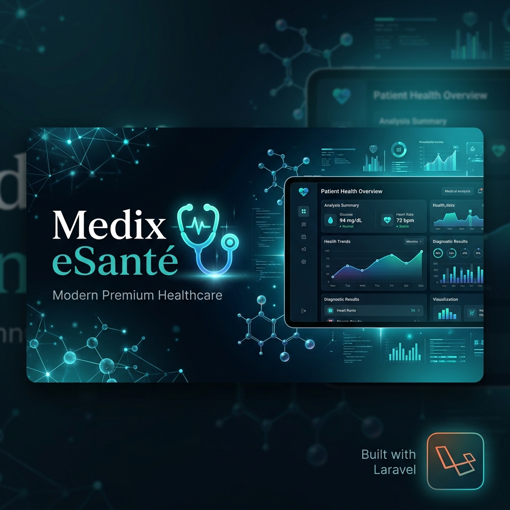

<p align="center">
  
</p>

# 🏥 Medix eSanté (MedixLab)
### *The Ultimate Connected Healthcare Ecosystem & Medical Analysis Platform*

---

<div align="center">
  
  [](https://laravel.com)
  [](https://tailwindcss.com)
  [](https://php.net)
  [](LICENSE)

</div>

---

## 🌐 Hosted Live Demo & Preview

Medix eSanté is fully deployed and ready for live inspection. Click the badge below to access the hosted platform:

<div align="center">
  <a href="https://medixlab.alwaysdata.net" target="_blank" style="text-decoration:none;">
    
  </a>
</div>


## 🌟 Value Proposition (Why MedixLab?)

MedixLab is designed to be sold as a **SaaS solution** or **on-premise enterprise software** for healthcare groups, hospital networks, or independent laboratories. 

*   **Unified Workflows**: Eliminates paper clutter by digitalizing the entire prescription-to-result loop.
*   **Secure Access Control**: Protects patients' private medical data through a state-of-the-art consent system where patients hold the keys to their record access.
*   **Resource Optimization**: Features integrated inventory tracking and equipment maintenance tools to keep labs running with zero downtime.
*   **Premium User Experience**: Designed with modern visual principles, including responsive interfaces, soft gradients, glassmorphism elements, and micro-animations.

---

## 👥 Integrated Portals & Roles

### 1. 🩸 Patient Portal
An intuitive dashboard focused on transparency, simplicity, and ease of use:
*   **Visual Progress Stepper**: Track the status of every prescription in real-time (`Prescription` ➔ `Lab Choose` ➔ `Collected` ➔ `In Progress` ➔ `Completed`).
*   **Smart Laboratory Selector**: Filter labs by city, check if they offer all required exams in the prescription, and preview transparent pricing breakdown before booking.
*   **Medical History Timeline**: A complete chronological list of all past exam requests, lab parameters, normal/high/low reference flags, and doctor interpretations.
*   **PDF Export & Print**: Generate professional, print-optimized clinical reports with a single click.
*   **Security Control Center**: Review active doctor authorizations, set expiration dates, and revoke doctor access instantly.

### 2. 🥼 Doctor Portal
A clinical workstation designed to minimize admin overhead:
*   **My Patients Directory**: Instantly access active patient medical folders and view their complete clinical history.
*   **Request Access**: Request authorization to view new patient files using secure unique patient codes.
*   **Smart Prescription System**: Create custom prescriptions or apply custom pre-saved **Exam Groups** (e.g. "Bilan Hépatique", "Bilan Lipidique") with custom clinical notes.
*   **Clinical Validation**: Review detailed lab values and submit professional interpretations to patients instantly.

### 3. 🔬 Medical Laboratory (Center) Portal
A functional center operations dashboard:
*   **Live Workload Overview**: Analyze real-time statistics of pending requests and view a 7-day dynamic daily request chart.
*   **Result Capture Board**: Enter parameters, flags, and values with automatic normal/abnormal bounds highlighting.
*   **Stock & Consumables Manager**: Real-time inventory tracking with threshold indicators. Sends immediate internal notifications when stock drops below the minimum limit.
*   **Equipment & Maintenance Log**: Monitor equipment status and track scheduled maintenance to ensure lab reliability.
*   **Custom Schedule & Calendar**: Set weekly working hours and exception holidays/closures easily.

### 4. 🔑 Admin Portal
A platform control center to oversee operations:
*   **Interactive Analytics Board**: Visual Chart.js charts representing 15-day volume trends, request status distributions, and Top 5 most prescribed exams.
*   **Catalogs Management**: Manage, update, or archive the list of available medical exams and reference values.
*   **User & Laboratory Registrations**: Fully audit user roles, laboratory networks, and staff permissions.
*   **Invitations by Email**: Send secure, expiring activation links instead of manually provisioning passwords.
*   **Immutable Audit Trail**: Every sensitive action is timestamped, IP-tagged, and searchable — exportable to PDF.
*   **RGPD Command Center**: Consent logs, data export/erasure requests, and an incident register (art. 33/34).

---

## 🛠 Tech Stack & Architecture

- **Backend Framework**: Laravel 13.x (PHP 8.3+)
- **Frontend Architecture**: TailwindCSS 3.x, Vanilla JavaScript (Fast, responsive, zero-bloat compilation).
- **Database**: Relational Database (MySQL, PostgreSQL, or SQLite).
- **Charting & Visuals**: Chart.js for interactive analytics.
- **Server-Side PDF**: dompdf for official clinical reports and audit-trail exports.
- **i18n**: French-first UI with an English mode — a `?lang=`/session/cookie based `SetLocale` middleware and a FR/EN switcher in every top navigation bar. Centralized strings live in `lang/fr.json` / `lang/en.json`.
- **Code Organization**: Clean separation of concerns with dedicated **Service layers** (`ExamRequestService`, `NotificationService`, `StockService`, `TwoFactorService`) and strict Form Requests validation.
- **Security & Reliability**:
  - Rate limiting on authentication routes.
  - Email verification on registration (signed, time-boxed links).
  - One-time 2FA codes delivered by email, stored hashed.
  - Password strength validation bar in registration forms.
  - Multi-step DB writes wrapped in transactions.
  - Anti-collision generator for medical codes (CNOM, Staff ID, Patient Identifier).
  - Centralized scheduled tasks for access expiry, RGPD retention purge and database backups.

---

## 💾 Installation & Setup

Follow these steps to run MedixLab locally:

### 1. Prerequisites
Ensure you have **PHP 8.2+**, **Composer**, and **Node.js** installed on your machine.

### 2. Clone the Repository
```bash
git clone https://github.com/your-repo/medixLab.git
cd medixLab
```

### 3. Install Dependencies
```bash
composer install
npm install
```

### 4. Environment Configuration
Copy the environment template and set your database credentials:
```bash
cp .env.example .env
php artisan key:generate
```

Configure your `.env` database details:
```env
DB_CONNECTION=mysql
DB_HOST=127.0.0.1
DB_DATABASE=medixlab
DB_USERNAME=root
DB_PASSWORD=
```

*Note: Default mailer `MAIL_MAILER` is set to `log`. Sent emails are logged in `storage/logs/laravel.log` for easy testing without an SMTP server.*

### 5. Run Migrations & Seeders
Populate the database with sample exams, parameters, and roles:
```bash
php artisan migrate:fresh --seed
```

### 6. Build Assets & Start Server
Run the dev server and vite bundler:
```bash
# In terminal 1
npm run dev

# In terminal 2
php artisan serve
```
Visit the app at `https://medixlab.alwaysdata.net/`.

---

## 🔒 Security & Privacy Compliance
MedixLab takes security seriously. Patient identifiers are generated using collision-free mathematical sequences (e.g. ID-based checksum codes) rather than public timestamps. No doctor can read a patient's historical analysis without explicit authorization from the patient. Access tokens expire automatically to guarantee maximum user data protection.

### RGPD / GDPR readiness
*   **Consent logs** — each registration records the accepted versions of the Terms and the Privacy Policy, with IP and user-agent (immutable `consents` table).
*   **Data portability** — admins export a structured JSON of a patient's full account.
*   **Right to erasure** — anonymisation keeps clinical data under the laboratory's legal retention duty; fully-anonymised accounts are purged after the configured retention period (`gdpr:retention-purge`).
*   **Incident register** — data-breach incidents (art. 33/34) are declared, tracked and resolved from the RGPD console.
*   **Legal pages** — public Terms, Privacy Policy and Legal Mentions, versioned for consent tracking.

### 🌍 Languages
The application ships in **French** (default) and **English**. Use the FR / EN switcher in the top navigation (or append `?lang=en` to any URL) to change the interface language; the choice is remembered per visitor via session + a persistent cookie.
